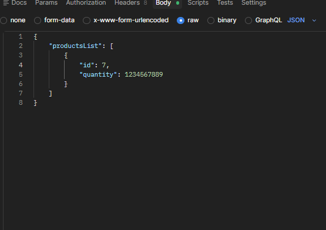

En este proyecto se realizaron varios casos de prueba de APIs en relacion a servicios de entrega, usando el codigo que aparece mas adelante como ejemplo de un caso de prueba relacionado a string vacio.

{
"deliveryTime": " ",
"productsCount": 2,
"productsWeight": 3
}

El proyecto se baso en el uso de un URL del servidor y un endpoint para realizar los pedidos teniendo en cuenta que son tres datos que se agregan, el tiempo en el que se solicita el envio, la cantidad de productos y el peso total de los productos, teniendo en cuenta estos 2 datos se calcula un precio que tendra el servicio de envio.
Teniendo en cuenta que para los casos de prueba se debe de cuestionar a detalle el funcionamiento y esperar que ciertas funciones cuenten con limites y caracteres que no puedan ser admitidos como letras, caracteres especiales, numeros y letras, string vacio y por ultimo revisar que se haga el calculo adecuado del precio.

Herramientas usadas: Jira, Postman, APIs y Testing manual.
